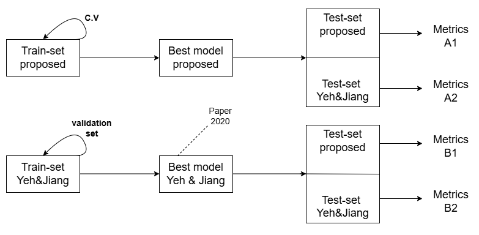
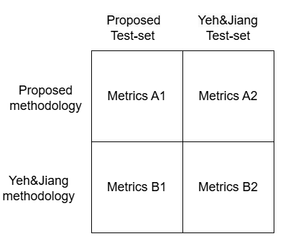

Test-Set proposed: 2 inputs (Global and Local). Dimensions: 201x1 and 61x1. (Shallue and Vanderburg (2018), Yu et al. (2019) ).

Test-Set Yeh & Jiang: 1 input. Dimensions: 144x1. (216x1, 288x1 and 360x1 are not available).

Yeh & Jiang provides 5 trained models:

---

name| period    | input

P12 | p = 1 ∼ 2 | 144

P23 | p = 2 ∼ 3 | 216

P34 | p = 3 ∼ 4 | 288

P45 | p = 4 ∼ 5 | 360 
