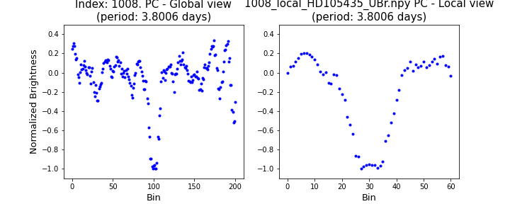
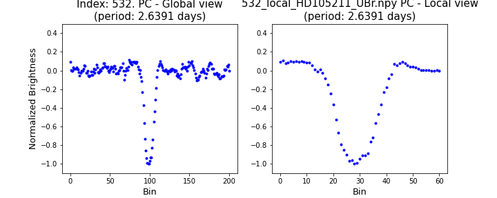

# Synthetic light curves of exoplanets using nanosatellite data

## Dataset Files

* **data_labeled_full.csv**: all examples, without filtering and split.

* **csv/data_train_full.csv**: 11641 examples for training and validation.

* **csv/data_test_full.csv**: 1294 examples for testing (include class label PC or NOT_PC). 

* **csv/data_test_without_label.csv:** data_test_full without the class label. 

*Note:* If the rows share the same *index* they correspond to the same example.

* **GeneratedSamples.zip**: Contains the folder GeneratedSamples. Available on: https://drive.google.com/file/d/1D9DJWmZf2WEOIn9Eb3GBhBG3aMVXUKJE/view?usp=sharing

## Folders

* **GeneratedSamples**: All generated examples (PC and NOT_PC) stored in .npy files (curve, phase fold, local view and global view).

* **GlobalLocalFigures**: Images of Local and Global View of the full data-set (without the manual selection).

* **/models**: trained DL models (for each K-fold and final models). 

* **/models_old**: Old methodology models from Fuentes, A., & Solar, M. (2024). Synthetic light curves of exoplanet transit using nanosatellite data. Astronomy and Computing, 47, 100816.

## Pipeline to generate a data set with synthetic exoplanetary transits

* **Create Examples.ipynb**: Main code.

* **BRITEObjects.zip**:  Contains the folder BRITEObjects with decorrelated BRITE objects npy. (without synthetic transits). (TO-DO: upload in host server)

* **Selection and Split.ipynb**: remove selected index, split in training and validation.

## Deep Learning models

* **Apply Models.ipynb**: differents architectures training with the data-set. (proposed + Yeh, L. C., & Jiang, G. (2020). Searching for possible exoplanet transits from BRITE data through a machine learning technique. Publications of the Astronomical Society of the Pacific, 133(1019), 014401.)

## Bibliography

- Yeh, L.‐C. and Jiang, G. (2020). Searching for possible exoplanet transits from brite data through a machine learning technique. Publications of the Astronomical Society of the Pacific,
133(1019):014401.

- Shallue, C. J. and Vanderburg, A. (2018). Identifying exoplanets with deep learning: A
five‐planet resonant chain around kepler‐80 and an eighth planet around kepler‐90. The
Astronomical Journal, 155(2):94.

- Yu, L., Vanderburg, A., Huang, C., Shallue, C. J., Crossfield, I. J., Gaudi, B. S., Daylan, T., Dattilo,
A., Armstrong, D. J., Ricker, G. R., et al. (2019). Identifying exoplanets with deep learning. iii.
automated triage and vetting of tess candidates. The Astronomical Journal, 158(1):25.

